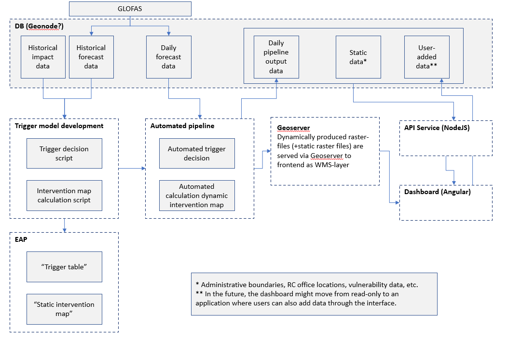

# IBF-system

**NOTE**: For now some background on IBF-terminology (e.g. triggers) is
expected. This can be expanded on later.

This is the repository for the IBF-system. It includes 3 main components.

1. [Trigger model development](./trigger-model-development/)

-   This contains the exploratory analysis for developing a trigger-model for a
    given country and disaster-type.
-   It might include (in the future) a lot of shared code between countries and
    disaster types, and even (automated) tools to aid analysts to develop
    trigger models.
-   The output is a `trigger script` which determines (per country/disaster
    type) when and where a trigger is reached.

2. [Services (backend)](./services/)

-   The `trigger script` is subsequently automated through (e.g. a daily
    running) service.
-   Results (as well as other related data) are stored in a database
-   Database content is returned through API-calls to some interface

3. [Interfaces (frontend)](./interfaces/)

-   Visualization of model results through dashboards
-   Dashboards might move from read-only to write-applications, where users can
    also add (secondary) data through an interface

## System design (draft)



## Installation using Docker

```
docker-compose -f docker-compose.yml up # for production

docker-compose up # for development

docker-compose -f docker-compose.yml -f docker-compose.override.yml up # for development (explicit)
```

These commands will install the IBF-system with listeners at,

1. [localhost](http://localhost) for the web server
2. \*development only - [localhost:4200](http://localhost:4200) for the web
   interface


## Releases
See notable changes and the currently release version in the [CHANGELOG](CHANGELOG.md).

### Release Checklist
This is how we create and publish a new release of the 121-platform.  
(See [the glossary](#glossary) for definitions of some terms.)

- [ ] Define the date/time of the release. (Notify the dev-team for a code-freeze.)
- [ ] Define what code gets released. ("_Is the current `master`-branch working?_")
- [ ] Define the `version`(-number) for the upcoming release.
- [ ] Update the [CHANGELOG](CHANGELOG.md) with the date + version.
  - [ ] Commit changes to `master`-branch on GitHub.
- [ ] Create a `release`-branch ("`release/<version>`") from current `master`-branch
  - [ ] Push this branch to GitHub
- [ ] "[Draft a release](https://github.com/rodekruis/IBF-system/releases/new)" on GitHub  
  - [ ] Add the `version` to create a new tag
  - [ ] Select the new `release/<version>`-branch
  - [ ] Set the title of the release to `version`
  - [ ] Add a short description and/or link to relevant other documents (if applicable)
  - [ ] NOTE: edit the env-variables on the "staging"-server before creating the release, as a deploy will automatically be triggered then (see [Deployment](#deployment) below)
  - [ ] Create/publish the release on GitHub

### Patch/Hotfix Checklist

This follows the same process as a regular release + deployment. With some small changes.
- Code does not need to be frozen. (As there is no active development on the release-branch)

#### Manual approach
- Checkout the `release/<version>`-branch that needs the hotfix.
- Create a new local branch (e.g. `release/<v0.x.1>`) and make the changes
- Push this branch directly to the main/upstream repository, not to a personal fork.
- Create a new release (see above) and publish it.  
  The publish-command will invoke the webhook(s), which trigger an automated deploy for environments on that same *minor* version.
- Add the hotfix-release to the [CHANGELOG](CHANGELOG.md)
- After the hotfix-release, apply the same fix to the master-branch in a regular PR (by creating a PR from the hotfix-branch to `master`-branch)

#### GitHub web-interface-only approach
- Browse to the specific file that needs a fix on GitHub, click "edit" and make the changes  
  The URL will look like: `https://github.com/rodekruis/IBF-system/edit/release/v0.x.0/<path-to-file>`
- Select "Create a new branch for this commit and start a pull request" from the "commit changes"-box
- Use `release/v0.x.1` as the branch-name by clicking "Propose changes"  
  This branch will now be created and is available to use for a new release
- Add the hotfix-release to the [CHANGELOG](CHANGELOG.md) and commit to the same `release/v0.x.1` branch.
- Create a new release (see above) and publish it.  
  The publish-command will invoke the webhook(s), which trigger an automated deploy for environments on that same *minor* version.
- After the hotfix-release, apply the fixes to the master-branch by merging the PR created.


## Deployment

### To "test" environment
- Merged PR's to 'master' branch are automatically deployed to the test-server. (via [webhook](tools/webhook.service), see: [/tools#GitHub-webhook](tools/README.md#github-webhook))
- Make sure to update the environment-settings mentioned in the Changelog as soon as possible, preferably before the merge+deploy.

### To "staging/production" environment
- When a release is created, it is automatically deployed to the staging-server.
- Make sure to update the environment-settings mentioned in the Changelog as soon as possible, preferably before creating the release.


## Glossary

| Term          | Definition (_we_ use)                                                                                        |
| ------------- | ------------------------------------------------------------------------------------------------------------ |
| `version`     | A 'number' specified in the [`SemVer`](https://semver.org/spec/v2.0.0.html)-format: `0.1.0`                  |
| `tag`         | A specific commit or point-in-time on the git-timeline; named after a version, i.e. `v0.1.0`                 |
| `release`     | A fixed 'state of the code-base', [published on GitHub](https://github.com/rodekruis/IBF-system/releases) |
| `deployment`  | An action performed to get (released) code running on an environment                                         |
| `environment` | A machine that can run code (with specified settings); i.e. a server or VM, or your local machine            |

